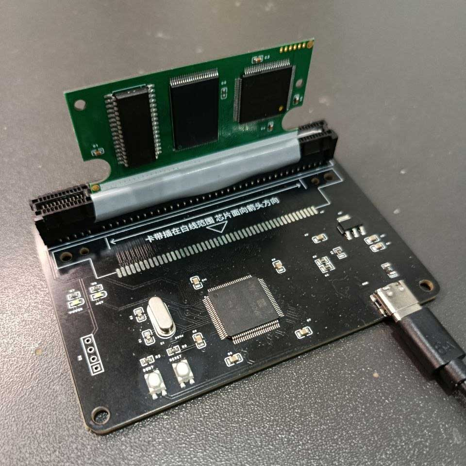
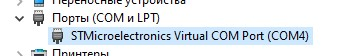

# Wonder Swine Flasher


**Wonder Swine Flasher** — Программа для чтения, записи, проверки и обслуживания совместимых WonderSwan / WonderSwan Color flash-картриджей на базе китайского программатора на STM32H750 и CPLD Altera MAX II EPM240.

Программа создавалась прежде всего для **Wonder Swine multicart**: собственного CPLD mapper'а, меню, нескольких ROM в одном 8 MiB NOR и независимых резервных копий save-data. При этом предусмотрен отдельный **Standalone**-режим для обычного Slot0.

> [!WARNING]
> Одинаковый внешний вид китайских картриджей **не гарантирует одинаковую разводку платы**. Перед первой прошивкой Wonder Swine CPLD рекомендуется считать исходную CPLD через Quartus `Examine` и проверить полученный `.pof` кнопкой **Check POF...**. Если программа показывает `UNKNOWN CPLD CONFIGURATION - DO NOT FLASH`, Wonder Swine CPLD на такую плату прошивать не следует, пока её совместимость не проверена отдельно.

---

## Что понадобится

### Для обычной работы с ROM и save

- ПК с **Windows x64**;
- совместимый WonderSwan flash-картридж;

- китайский **STM32H750 WonderSwan writer/dumper** (`USB H750 WSC flasher`);


- рабочий USB/Serial драйвер — writer должен появиться в Windows как COM-порт;


- `WonderSwineFlasher.exe`;
- `game_db.csv` рядом с EXE — нужен для `Scan cartridge` и определения названий/Product ID;
- WonderSwan / WonderSwan Color / SwanCrystal для проверки результата на реальном железе.

Картридж программируется через задние контакты слота; передние edge-контакты картриджа при работе с этим writer должны быть изолированы так же, как при использовании штатной китайской программы.

### Для первой установки / восстановления CPLD

Дополнительно нужны:

- **USB Blaster**;
- **Quartus II 13.0 SP1**;
- JTAG-доступ к EPM240 на картридже;
- release POF Wonder Swine CPLD — текущая проверенная аппаратная база проекта: **v1.33 `SELF_FLASH_CE_WRITEFIX`**.

Wonder Swine Flasher **не программирует CPLD через JTAG**. CPLD прошивается в Quartus Programmer. Кнопка `Check POF...` только анализирует выбранный POF-файл и ничего не записывает в картридж.

---

# Проверка платы перед первой прошивкой CPLD

Это рекомендуемый первый шаг для неизвестного экземпляра Compatible Replica.

1. Подключить картридж к USB Blaster.
2. В Quartus Programmer выполнить **Auto Detect** — ожидается устройство семейства `EPM240`.
3. Выполнить **Examine** и сохранить считанный `.pof`.
4. Запустить Wonder Swine Flasher.
5. Нажать **Check POF...** и выбрать считанный файл.

Возможные результаты:

### `COMPATIBLE REPLICA - SUPPORTED`

Исходная CPLD побитно совпадает с известной и проверенной конфигурацией **Compatible Replica**. Для этой конфигурации установка Wonder Swine CPLD поддерживается.

### `WONDER SWINE CPLD vX.XX - UPDATE / RECOVERY ONLY`

Выбранный POF относится к семейству Wonder Swine CPLD.

Если POF был только что считан через `Examine` с картриджа — Wonder Swine CPLD уже установлена. Повторная прошивка нужна только для обновления или восстановления.

Текущая v1.33 появилась до введения постоянного UFM-ID и распознаётся по точному CFM fingerprint. Будущие версии могут содержать постоянную UFM-сигнатуру семейства `WSWCPLD!` и номер версии.

### `UNKNOWN CPLD CONFIGURATION - DO NOT FLASH`

POF структурно читается, но его конфигурация не известна проекту. Это **не доказывает**, что плата несовместима, однако прошивать Wonder Swine CPLD на неё нельзя до отдельной проверки разводки.

---

# Быстрый старт

После установки Wonder Swine CPLD:

1. Вставить картридж в STM32H750 writer.
2. Запустить `WonderSwineFlasher.exe`.
3. Выбрать COM-порт и нажать **Connect**.
4. Для Wonder Swine выбрать `Multicart (Menu + Games)`.
5. Дождаться зелёного статуса:

```text
CPLD: Wonder Swine compatible
```

6. Нажать **Scan cartridge**.
7. Двойным кликом по найденной игре можно автоматически выбрать её основной Slot и ROM size.
8. Перед заменой ROM обычно выполнить **Erase Selected ROM**.
9. Выполнить **Flash ROM...**.
10. После записи обязательно выполнить предложенный **Verify ROM...**.

> [!IMPORTANT]
> NOR Flash нельзя считать обычным перезаписываемым диском. При замене уже записанного ROM необходимо сначала стереть выбранную ячейку игры, после чего записать ROM и сделать проверку.

---

# Режимы

## Multicart (Menu + Games)

Основной режим Wonder Swine.

Доступны:

```text
Menu
Game1
Game2
Game3
Game4
Game5
Game6
Game7
```

`Menu` всегда использует размер **512K**.

Размеры ROM, доступные для прямых операций программы:

```text
512K
1M
2M
4M
8M
```

`8M` предназначен для Standalone и не разрешён внутри стандартной multicart-разметки.

При подключении в Multicart mode программа автоматически выполняет **read-only CPLD compatibility probe**: сравнивает видимый ROM после выбора `Menu`, `Game1` и `Game7`.

Статусы:

- **зелёный** `CPLD: Wonder Swine compatible` — runtime slot switching работает;
- **красный** `CPLD: stock / unsupported` — переключение слотов не обнаружено;
- **оранжевый** `CPLD: check inconclusive` — например, все проверяемые окна полностью пустые (`FF`), а также если картридж вовсе отсутствует в программаторе.

Если совместимость не подтверждена, опасные Multicart-операции автоматически блокируются.

## Standalone ROM (Slot0)

Режим обычного single-ROM Slot0 без Wonder Swine multicart layout.

Используется для чтения/обслуживания одиночного ROM или работы с исходной single-game конфигурацией. Разрушительные операции дополнительно показывают предупреждение о выбранном размере и физическом top-aligned диапазоне Flash.

---

# Описание функций

## Connection

### Refresh COM

Обновляет список доступных COM-портов.

### Connect / Disconnect

Открывает или закрывает соединение с STM32H750 writer.

В Multicart mode после подключения автоматически выполняется CPLD compatibility probe. В Standalone mode выполняется нормализация Slot0.

### CPLD status

Показывает результат runtime-проверки mapper'а:

- Wonder Swine compatible;
- stock / unsupported;
- check inconclusive;
- not checked.

### About

Версия программы, автор и ссылка на проект.

---

## Cartridge / ROM

### Mode

Переключает между:

- `Multicart (Menu + Games)`;
- `Standalone ROM (Slot0)`.

### Slot

Выбор `Menu` / `Game1..Game7` в Multicart или `Slot0` в Standalone.

### Size

Выбор размера области ROM: `512K`, `1M`, `2M`, `4M`, `8M`.

Для `Menu` в Multicart размер принудительно фиксируется на `512K`.

### Switch

Переключает Wonder Swine CPLD на выбранный логический Slot. Содержимое Flash не изменяется.

### ROM Info

Читает WonderSwan footer выбранного ROM и показывает, насколько это возможно:

- название игры;
- Product ID;
- Header ID;
- Developer;
- WonderSwan / WonderSwan Color;
- Game ID;
- Revision;
- ROM size;
- save type;
- checksum из footer;
- сырые footer-байты.

Название и Product ID берутся из внешнего `game_db.csv`.

### Check POF...

Офлайн-проверка файла Altera MAX II `.pof`.

Проверяются:

- структура POF;
- target/device information;
- CFM size;
- CFM checksum;
- SHA-256 CFM;
- UFM;
- Wonder Swine UFM identity, если присутствует;
- CRC-16/X-25 контейнера;
- SHA-256 полного POF.

Кнопка **не требует подключения программатора и ничего не прошивает**.

### Read ROM...

Считывает выбранную ROM-область в `.ws` / `.wsc` файл.

После завершения программа:

- закрывает файл;
- считает SHA-256 полученного дампа;
- показывает итоговый размер и hash.

Операция read-only.

### Flash ROM...

Записывает ROM выбранного размера.

Особенности:

- размер файла должен точно соответствовать выбранному ROM size;
- полностью `FF` 1 KiB блоки не отправляются на программирование;
- после завершения программа предлагает сразу выполнить проверку (Verify);
- для Multicart Menu применяются специальные правила защиты system sector.

### Verify ROM...

Считывает ROM с картриджа и сравнивает его с выбранным файлом байт-в-байт.

### Erase Selected ROM

Стирает только выбранную ROM-область и затем проверяет, что она стала `FF`.

### ERASE ALL USED

Стирает **все ROM-области стандартной Wonder Swine multicart-разметки**, но сохраняет persistent data.

Используется для полной очистки игр и Menu code без уничтожения резервных save-vault.

### STOP / disconnect

Аварийно прерывает host-side операцию закрытием serial-порта.

После STOP необходимо заново подключиться. Если STOP был выполнен во время записи/стирания, область следует считать **dirty/incomplete** до последующей проверки и, при необходимости, повторного erase.

---

# Save functions

Физический картридж имеет одну общую live save-memory область 32 KiB. Wonder Swine Menu виртуализирует независимые сохранения, резервируя их в NOR vault'ах.

## Read Save (safe)...

Безопасно считывает текущую **shared 32 KiB MRAM**.

Программа выполняет **два независимых чтения** и принимает результат только если они совпадают байт-в-байт. После этого сохраняется `.sav` и показывается SHA-256.

## Flash Save (safe)...

Записывает `.sav` в shared MRAM.

Защитный порядок:

1. входной файл должен быть ровно **32768 байт**;
2. перед записью программа дважды безопасно считывает текущую MRAM;
3. автоматически создаёт timestamped backup `WSF_save_backup_*.sav`;
4. показывает hash исходного файла и backup;
5. требует отдельного подтверждения пользователя;
6. записывает save блоками;
7. повторно считывает MRAM;
8. выполняет byte-for-byte verify.

При verify failure считанный проблемный образ также сохраняется на диск.

## Export All Vault Saves...

Доступно в **Multicart mode**.

Это read-only recovery/export функция. Она:

1. один раз считывает полный физический **8 MiB NOR**;
2. извлекает vault banks (`Game1..Game7`);
3. проверяет V7 header и CRC16 каждого vault;
4. экспортирует только валидные 32 KiB save payload;
5. использует встроенный в новые vault'ы `WSID` для определения игры;
6. создаёт `Wonder_Swine_save_vaults_manifest.txt` с результатами и SHA-256 экспортированных save.

Эта функция специально остаётся доступной даже если runtime Wonder Swine CPLD не подтверждена: она использует полный физический read writer'а и не зависит от логического slot switching.

---

# Cartridge contents / Scan cartridge

`Scan cartridge` выполняет быстрый scan без полного hashing всех ROM.

Flasher читает только необходимые 512 KiB окна реальных slot-anchor'ов, разбирает WonderSwan footer и использует `game_db.csv` для отображения:

- Slot;
- Game title;
- ROM size;
- число занятых блоков;
- Product ID;
- Header ID;
- Save type.

Продолжения больших ROM автоматически пропускаются: например, 4 MiB игра занимает несколько логических блоков, но показывается одной строкой на своём основном anchor slot.

### Двойной клик по строке

Если размер ROM поддерживается основными контролами Flasher, двойной клик:

- выбирает соответствующий Slot;
- выбирает ROM Size;
- при активном соединении переключает CPLD на этот слот.

Сам по себе двойной клик **никогда не запускает Flash, Erase или другую разрушительную операцию**.

---

# game_db.csv

`game_db.csv` — внешний редактируемый каталог игр. Он **не зашит в EXE** и должен лежать рядом с программой.

Рекомендуемый формат:

```csv
Developer,Color,GameID,Revision,ProductID,Title
01,00,08,00,SWJ-BAN008,Kaze no Klonoa - Moonlight Museum
01,00,13,00,SWJ-BAN013,Rockman & Forte - Mirai Kara no Chousen Sha
01,01,35,00,SWJ-BANC35,Rockman EXE WS
```

Первые четыре поля — двухзначные HEX-значения WonderSwan footer.

`ProductID` можно оставить пустым.

Если несколько игр имеют одинаковый footer ID, Flasher не угадывает: несколько известных Title/Product ID объединяются через ` | `.

После изменения CSV программу нужно перезапустить.

Если `game_db.csv` отсутствует или не читается, программа продолжает работать, но **Scan cartridge** блокируется. Основные Read/Flash/Verify/Erase/Save/Check POF функции от базы названий не зависят.

---

# Raw protocol (diagnostic)

Поле `Raw protocol` позволяет вручную отправить HEX-пакет программатору.

Пример формата:

```text
2B AA 55 AA BB 00
```

> [!ВНИМАНИЕ]
> Это не для простого пользователя. Неверная команда может изменить состояние mapper'а или запустить операцию прграмматора. Используйте Raw protocol только если действительно понимаете что делаете.

`Clear log` очищает текстовое окно текущего лога.

Кроме экранного лога программа ведёт файл:

```text
Wonder_Swine_Flasher_session.log
```

рядом с EXE.

---

512 KiB файл Wonder Swine Menu резервирует свои первые 64 KiB под live `bank78`, поэтому этот участок release Menu ROM должен оставаться `FF`.

Flasher знает об этой разметке и специально защищает `bank78` во время Menu erase/program/verify.

---

# Рекомендуемый рабочий порядок

## Запись/замена игры

```text
Connect
→ CPLD: Wonder Swine compatible
→ Scan cartridge
→ выбрать Game slot / размер
→ Erase Selected ROM
→ Flash ROM
→ Verify ROM
→ проверить игру на консоли
```

## Обновление Wonder Swine Menu

```text
Connect
→ Multicart / Menu / 512K
→ Erase Selected ROM
   (bank78 сохраняется автоматически)
→ Flash ROM с новым Wonder Swine Menu
→ Verify ROM
→ проверить загрузку Menu на консоли
```

## Первая установка CPLD на новый Compatible Replica

```text
Quartus Auto Detect
→ Examine исходной CPLD
→ сохранить POF
→ Wonder Swine Flasher / Check POF...
→ COMPATIBLE REPLICA - SUPPORTED
→ только после этого Program Wonder Swine CPLD через Quartus
→ подключить картридж к STM32 writer
→ Connect в Flasher
→ убедиться: CPLD: Wonder Swine compatible
```

---

# Важные предупреждения

- **Всегда сохраняйте исходный CPLD POF** перед первой перепрошивкой.
- Не прошивайте Wonder Swine CPLD на неизвестную ревизию платы только из-за похожего внешнего вида.
- Перед заменой ROM безопаснее выполнить erase выбранной области.
- После Flash всегда выполняйте Verify.
- `ERASE ALL USED` сохраняет vault/journal, но уничтожает ROM-данные стандартной multicart-разметки.
- `STOP` во время записи/erase может оставить незавершённое содержимое; перед повторной записью проверьте или сотрите область.
- Не отключайте питание и не вытаскивайте картридж во время Flash/Erase/Save write.
- `Raw protocol` предназначен для диагностики, а не для обычной эксплуатации.
- Не считайте `Check POF: UNKNOWN` доказательством несовместимости — это означает только, что такая конфигурация ещё не проверена проектом.

---

# Автор

**Black Ace**  
© 2026  
GitHub: `github.com/cjblackace`

Wonder Swine Flasher — часть проекта **Wonder Swine**: multicart / Menu / CPLD / PC-side tooling для WonderSwan.
